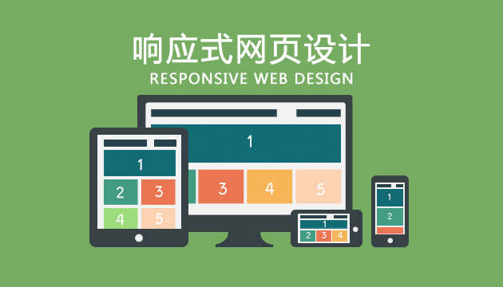

# 响应式网页设计

## 1 什么是响应式设计

### 1.1 定义

伊桑·马科特（Ethan Marcotte）在2010年首先提出了响应式网页设计（RWD,Responsive Web Design）这个术语。在他的一篇文章《Responsive Web Design · An A List Apart Article》中他将已有的三种发开技巧（弹性图片，弹性网格布局，媒体与媒体查询） 进行了整合，命名为响应式网页设计。

那什么才是真正的响应式设计？马科特说，真正的响应式设计方法不仅仅是根据可视区域大小而改变网页布局，而是要从整体上颠覆当前网页的设计方法，是针对任意设备的网页内容进行完美布局的一种显示机制。

### 1.2 响应式设计的优势	

* 开发、维护、运营成本优势：页面只有一个，只是针对不同的分辨率、 不同的设备环境进行了一些不同的设计，所以在开发、维护和运营上， 相对多个版本，能节约成本。
* 兼容性优势：移动设备新的尺寸层出不穷，定制的版本通常只适用于某些规格的设备，如果新的设备分辨率变化较大，则往往不能兼容，而开发新的版本需要时间，这段时间内的访问就是个问题， 但是响应式Web设计可以提前预防这个问题。
* 操作灵活：响应式设计是针对页面的，可以只对必要的页面进行改动，其他页面不受影响。

### 2 屏幕的相关概念

* 分辨率 resolutio		是指显示器所能显示的像素的多少

* 像素密度		单位： dpi（dots per inch）  ppi

  > 像素密度（pixels per inch），也称PPi，即每英寸屏幕所拥有的像素数，像素密度越大，显示画面细节就越丰富。 
  > 像素密度=√{（长度像素数^2+宽度像素数^2）}/ 屏幕尺寸
  >
  > iphone3G 165dpi      320px * 480px;
  > iphone4    326 dpi     640px * 960px
  > iphone6s  326dpi      1334px * 750px	

* 每像素包含点的数量(dppx)	

  > 用 iPhone4 举个例子，它有 326 DPI 显示屏，根据上表，智能手机的典型观看距离大概16.8英寸，基准像素为 160 DPI。所以要显示一个 CSS 像素，苹果选择将像素比设置为2，所以看起来就和 163 DPI 手机中显示的一样了。	

* 设备像素比(dip或dpr)		同 dppx

* 视网膜屏幕	

  > ​        视网膜（Retina）屏幕是苹果公司在部分移动产品使用的一种屏幕。第一次被人们熟知，是苹果将其用在iphone 4手机上，它将960×640的分辨率压缩到一个3.5英寸的显示屏内。也就是说，该屏幕的像素密度达到326像素/英寸（ppi），称之为“视网膜屏幕”。通常电脑显示屏幕的分辨率为72ppi，iPhone 4的分辨率为电脑的4倍多。由于其具备超高像素密度的液晶屏，因此屏幕显示异常清晰、锐利。		

* 常见设备屏幕信息  https://github.com/h5bp/mobile-boilerplate/wiki/Mobile-Matrices

