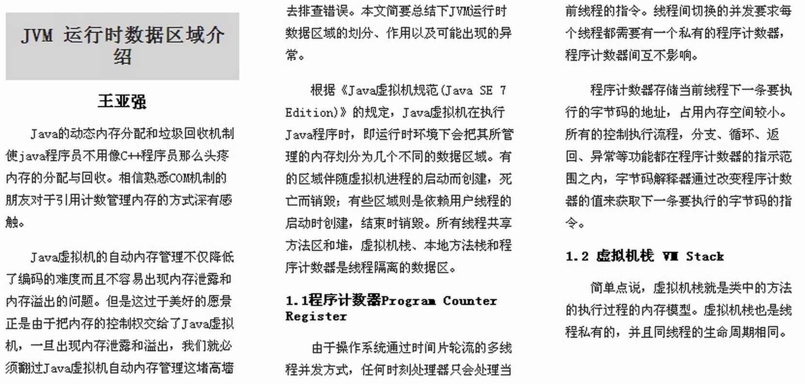

# 新的页面布局方式

## 1 多列布局

### 1.1 多列布局介绍

实现类似于报纸的布局方式

)

### 1.2 多列布局的相关CSS属性

* columns		设置的列数和每列的宽度。复合属性 	

  ```css
  columns：<' column-width '> || <' column-count '>		
  ```

* column-width	设置每列的宽度（类似于最小宽度）	

  > <length>： 用长度值来定义列宽。不允许负值 
  > auto： 根据 <' column-count '> 自定分配宽度	 

* column-count	设置列数

  > <integer>： 用整数值来定义列数。不允许负值 
  > auto： 根据 <' column-width '> 自定分配宽度 				

* column-gap	设置列与列之间的间隙

  > <length>： 用长度值来定义列与列之间的间隙。不允许负值 
  > normal： 与 <' font-size '> 大小相同。假设该对象的font-size为16px，则normal值为16px，类推。 			

​		

* column-rule		

​	列与列之间的边框,复合属性 同border类似
		column-rule：<' column-rule-width '> || <' column-rule-style '> || <' column-rule-color '>

* column-rule-width	

​	列与列之间的边框厚度			
		<length>： 用长度值来定义边框的厚度。不允许负值 
		medium： 定义默认厚度的边框。 
		thin： 定义比默认厚度细的边框。 
		thick： 定义比默认厚度粗的边框。 

* column-rule-style	

​	列与列之间的边框样式			
		none： 无轮廓。<' column-rule-color '> 与<' column-rule-width '> 将被忽略 
		hidden： 隐藏边框。 
		dotted： 点状轮廓。 
		dashed： 虚线轮廓。 
		solid： 实线轮廓 
		double： 双线轮廓。两条单线与其间隔的和等于指定的 <' column-rule-width '> 值 
		groove： 3D凹槽轮廓。 
		ridge： 3D凸槽轮廓。 
		inset： 3D凹边轮廓。 
		outset： 3D凸边轮廓。 

* column-rule-color	

​	列与列之间的边框颜色			

* column-span		

​	对象元素是否横跨所有列			
		none： 不跨列 (默认)
		all： 横跨所有列 

* column-fill		

​	

	所有列的高度是否统一			
		auto： 列高度自适应内容 (默认)
		balance： 所有列的高度以其中最高的一列统一 
* column-break-before	

​	对象之前是否断行			
		auto： 既不强迫也不禁止在元素之前断行并产生新列 (默认)
		always： 总是在元素之前断行并产生新列 
		avoid： 避免在元素之前断行并产生新列 

* column-break-after	

​	对象之后是否断行			
		auto： 既不强迫也不禁止在元素之后断行并产生新列 
		always： 总是在元素之后断行并产生新列 
		avoid： 避免在元素之后断行并产生新列 

* column-break-inside	

​	对象内部是否断行			
		auto： 既不强迫也不禁止在元素内部断行并产生新列 (默认)
		avoid： 避免在元素内部断行并产生新列 